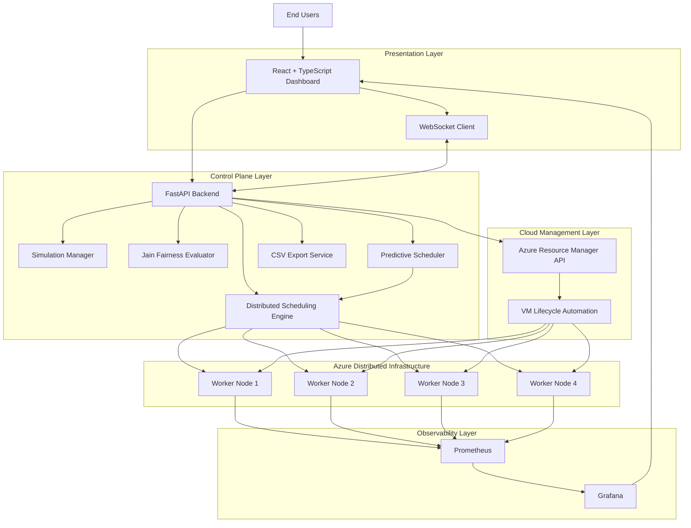

# AI-Based Distributed Load Balancing Platform

A cloud-native distributed systems platform designed to evaluate, monitor, and automate workload scheduling across Microsoft Azure Virtual Machines. The project combines distributed resource management, cloud infrastructure automation, real-time observability, simulation-based evaluation, and predictive scheduling concepts within a unified web application.

The platform was developed as part of a Master's Capstone Project to investigate how different load balancing strategies perform under varying workload conditions while providing operational visibility and infrastructure control through a modern web-based dashboard.

---

## Project Overview

Distributed systems play a critical role in modern computing environments where applications must operate across multiple interconnected resources while maintaining performance, scalability, and reliability. One of the most significant challenges in such environments is determining how workloads should be allocated among available resources to maximise utilisation without introducing bottlenecks or resource starvation.

This project addresses that challenge through the development of an AI-Based Distributed Load Balancing Platform capable of managing workloads across multiple Azure Virtual Machines. The system provides an interactive environment for evaluating scheduling algorithms, analysing workload distribution behaviour, monitoring infrastructure resources, and automating cloud operations.

Unlike traditional simulation-only scheduling projects, this platform integrates directly with Microsoft Azure infrastructure, enabling scheduling decisions and workload execution to be evaluated using real cloud resources. The resulting system provides a practical demonstration of distributed computing principles while incorporating observability, automation, fairness analysis, and predictive scheduling concepts.

---

## System Architecture

The platform follows a layered distributed architecture that separates user interaction, orchestration, workload execution, monitoring, and cloud management responsibilities.

The architecture enables workload scheduling, infrastructure automation, simulation execution, and operational monitoring to function as an integrated platform while maintaining modularity and extensibility.

---

## Distributed Scheduling Framework

The scheduling engine forms the core component of the platform. It is responsible for receiving workload requests, evaluating worker node availability, selecting an allocation strategy, and dispatching tasks to distributed worker nodes.

Several scheduling approaches have been implemented to support comparative analysis:

### Static Scheduling

Static Scheduling allocates workloads using predefined assignment rules. Although computationally efficient, the approach lacks adaptability and therefore provides a useful baseline for comparison.

### Round Robin Scheduling

Round Robin Scheduling distributes workloads sequentially among worker nodes. The strategy provides balanced allocation under homogeneous conditions but does not account for resource utilisation differences.

### Least Loaded Scheduling

Least Loaded Scheduling dynamically evaluates worker node utilisation before assigning workloads. This approach generally provides superior resource utilisation and was selected as the preferred scheduling strategy for practical deployment.

### Fairness-Based Scheduling

The Fairness Scheduling approach focuses on equitable workload distribution among available nodes. Allocation fairness is evaluated using Jain’s Fairness Index, enabling objective analysis of resource distribution quality.

### Predictive Scheduling Prototype

A proof-of-concept predictive scheduling module was developed using Linear Regression techniques. The objective of this module is to explore proactive workload allocation based on future resource utilisation forecasts rather than solely reacting to current conditions.

---

## Azure Cloud Infrastructure

A significant objective of the project was the deployment of the scheduling platform on real cloud infrastructure rather than relying exclusively on simulated environments.

The distributed execution environment consists of multiple Azure Virtual Machines operating as worker nodes. Each node participates in workload processing and reports operational metrics back to the platform.

The system integrates directly with Azure Resource Manager APIs, allowing administrators to perform infrastructure operations through the web application. Virtual machine lifecycle management functions include:

* Infrastructure status monitoring
* Virtual machine startup
* Virtual machine shutdown
* Virtual machine restart
* Resource synchronisation

By integrating cloud automation directly into the platform, the project extends beyond workload scheduling and demonstrates practical cloud operations capabilities.

---

## Monitoring and Observability

Observability is a fundamental requirement within distributed systems because operational behaviour emerges from interactions between multiple independent components.

To address this requirement, the platform incorporates Prometheus and Grafana to provide comprehensive monitoring and telemetry capabilities.

The monitoring subsystem collects and visualises:

* CPU utilisation
* Memory utilisation
* Node availability
* Task execution statistics
* Scheduling performance metrics
* Infrastructure health indicators

Real-time telemetry enables users to evaluate workload distribution behaviour and observe how different scheduling strategies respond under varying operating conditions.

---

## Simulation and Performance Evaluation

The platform provides a simulation framework that enables scheduling strategies to be evaluated under controlled workload conditions.

Users can execute simulations using different scheduling approaches and compare system behaviour under various workload scenarios.

Simulation modes include:

### Normal Workload

Represents baseline operational demand and is used to establish performance benchmarks.

### Burst Workload

Represents sudden increases in workload intensity and evaluates the platform’s ability to maintain performance during peak demand periods.

### Failure Simulation

Evaluates fault tolerance by introducing worker node failures and observing workload redistribution behaviour.

Simulation results are collected automatically and can be exported for further analysis through CSV reporting capabilities.

---

## Fairness Analysis

Performance optimisation alone does not necessarily imply effective resource management. Consequently, the platform incorporates fairness evaluation mechanisms to assess the quality of workload distribution.

Jain’s Fairness Index is used to quantify workload allocation equity among worker nodes. This metric provides insight into whether resources are being utilised fairly and helps identify situations where workloads become concentrated on specific nodes.

The inclusion of fairness analysis extends evaluation beyond traditional performance metrics and provides a broader perspective on scheduling effectiveness.

---

## Chaos Engineering and Fault Tolerance

Modern distributed systems must continue operating despite component failures. To evaluate system resilience, the platform incorporates chaos engineering capabilities that intentionally introduce failures into the distributed environment.

Failure scenarios can be executed to assess:

* Node availability management
* Workload redistribution behaviour
* Recovery mechanisms
* Service continuity

These experiments provide valuable insight into how scheduling strategies respond when infrastructure resources become unavailable.

---

## Deployment

The platform is publicly accessible through a cloud-hosted deployment.

**Live Application**

https://ai-resource-scheduler.onrender.com

The application is deployed using Render and provides a publicly accessible interface for workload scheduling, infrastructure management, simulation execution, and performance monitoring.

Containerisation support is provided through Docker to simplify deployment and improve portability across environments.

---

## Technology Stack

The platform combines a modern full-stack development approach with cloud-native technologies.

| Layer            | Technology              |
| ---------------- | ----------------------- |
| Frontend         | React, TypeScript, Vite |
| Backend          | FastAPI, Python         |
| Monitoring       | Prometheus, Grafana     |
| Cloud Platform   | Microsoft Azure         |
| Deployment       | Render                  |
| Containerisation | Docker                  |
| Machine Learning | Scikit-learn            |
| Communication    | REST APIs, WebSockets   |

---

## Academic Contribution

This project demonstrates the practical application of concepts drawn from several areas of computing and information technology, including:

* Distributed Systems
* Cloud Computing
* Resource Scheduling
* Load Balancing
* Infrastructure Automation
* Observability and Monitoring
* Fault Tolerance
* Performance Evaluation
* Machine Learning for Resource Management

The resulting platform serves as both a distributed systems research environment and a practical cloud operations tool, providing opportunities for future experimentation and enhancement.

---

## Future Development

Several opportunities exist for extending the platform beyond its current capabilities. Future work may involve the implementation of more advanced machine learning techniques, reinforcement learning-based scheduling, automated horizontal scaling, Kubernetes integration, and multi-cloud deployment support.

Further evaluation of predictive scheduling approaches could also improve workload forecasting accuracy and enable proactive resource allocation strategies capable of responding to demand before performance degradation occurs.

---

## Authors

Master's Capstone Project Team

Lead Developer and Testing Lead contribution focused on:

* Distributed scheduling architecture
* Azure cloud integration
* Infrastructure automation
* Monitoring and observability
* Simulation framework development
* Testing and evaluation

---

## License

This project was developed for academic and research purposes as part of a Master's Capstone Project.
